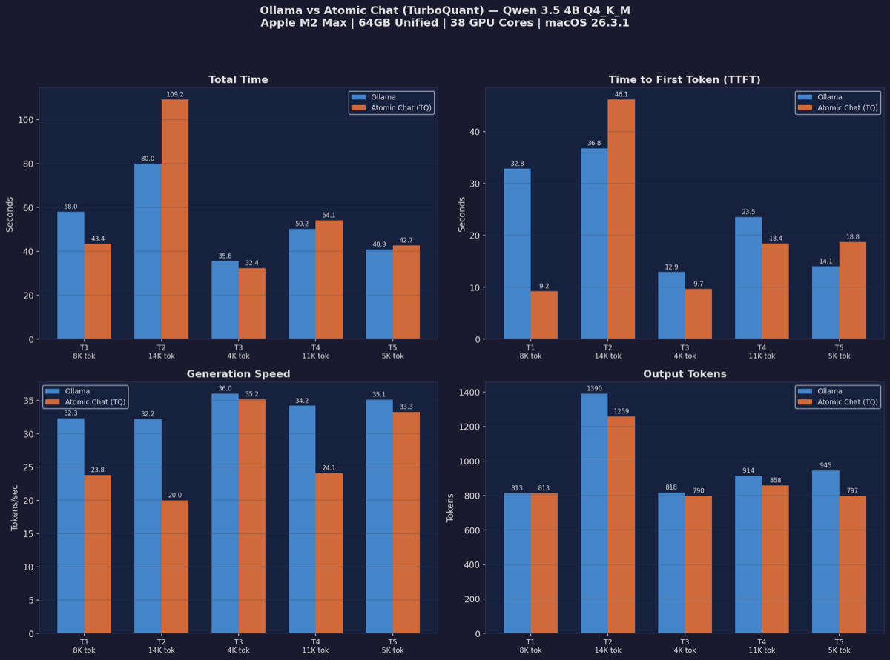
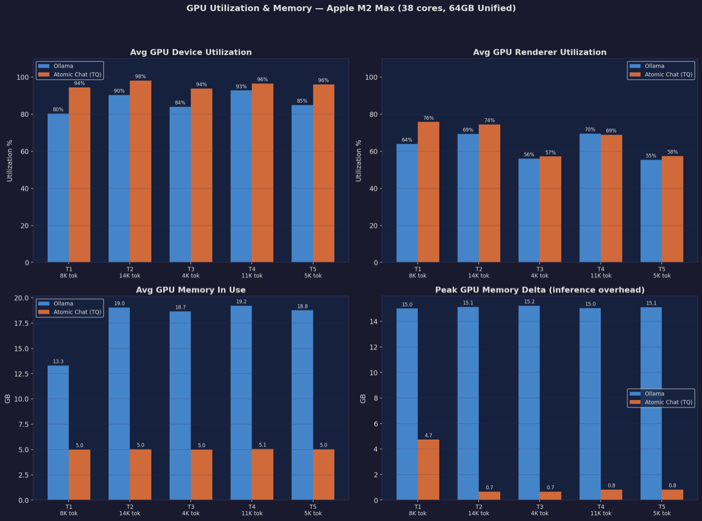
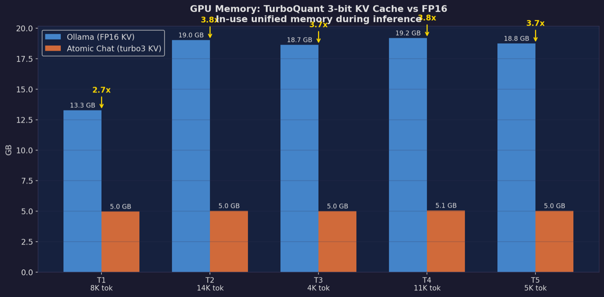
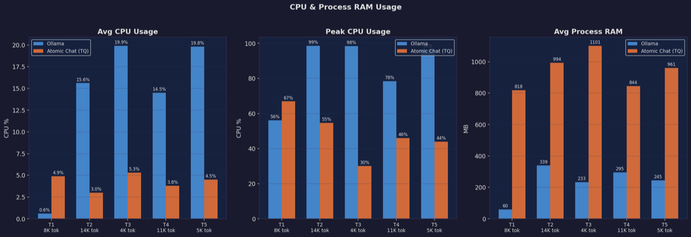
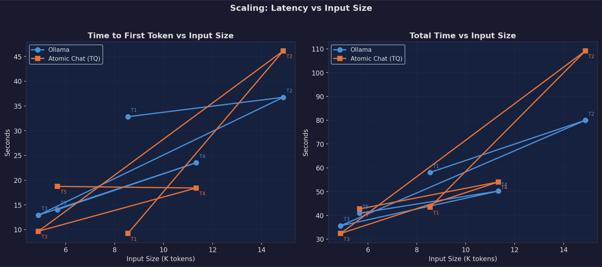

# LLM Inference Benchmark Report

## Ollama vs Atomic Chat (TurboQuant KV Cache)

**Date:** 2026-03-28
**Benchmark Version:** 1.0

---

## 1. Test Environment

### Hardware

| Component | Specification |
|---|---|
| **CPU** | Apple M2 Max |
| **CPU Cores** | 12 total (8 Performance + 4 Efficiency) |
| **GPU** | Integrated, 38 cores, Metal 4 |
| **Memory** | 64 GB Unified (shared CPU/GPU) |
| **Architecture** | ARM64 (Apple Silicon) |
| **OS** | macOS 26.3.1 |

### Model Under Test

| Property | Value |
|---|---|
| **Model** | Qwen 3.5 4B |
| **Parameters** | 4.7B |
| **Quantization** | Q4_K_M (GGUF) |
| **Family** | qwen35 |

### Backend Configuration

| | Ollama | Atomic Chat |
|---|---|---|
| **Engine** | llama.cpp (bundled) | llama.cpp (TurboQuant fork) |
| **Version** | Stock | `turboquant-macos-arm64-482581c` |
| **KV Cache Type** | FP16 (default) | **turbo3 (3-bit TurboQuant)** |
| **Context Window** | 32K | 32,768 |
| **GPU Layers** | Auto | Full (`-ngl -1`) |
| **Parallelism** | Default | 1 (`--parallel 1`) |
| **Extra Flags** | — | `--jinja`, `--kvu`, `--fit off`, `--mmproj` |
| **API Port** | 11434 | 1337 |

### Test Methodology

- **Task:** Meeting transcript summarization using identical system prompt
- **Prompt:** Standard Echosy (https://echosy.org) summary prompt (Overview, Key Points, Decisions, Action Items)
- **Warm start:** Both models loaded into GPU memory before testing (cold start eliminated)
- **Sequential execution:** Tests run one backend at a time to avoid GPU contention
- **Settle time:** 2-second pause between runs to let GPU state stabilize
- **Metrics collected:** Total time, TTFT, generation speed, output length, CPU%, process RAM, GPU utilization, GPU renderer utilization, GPU memory (in-use and delta)
- **Resource sampling:** 0.3s interval background thread via `ps` (CPU/RAM) and `ioreg IOAccelerator` (GPU)
- **GPU monitoring:** Device utilization %, Renderer utilization %, in-use unified memory, allocated memory — all via IOKit (no sudo required)

---

## 2. Test Corpus

| Test | Input Chars | Input Lines | Est. Tokens | Language |
|---|---:|---:|---:|---|
| **T1** | 34,158 | 496 | ~8,500 | EN / Cantonese |
| **T2** | 59,556 | 990 | ~14,900 | EN / Cantonese |
| **T3** | 19,533 | 250 | ~4,900 | EN / Mandarin |
| **T4** | 45,338 | 570 | ~11,300 | EN / Mandarin |
| **T5** | 22,645 | 242 | ~5,700 | EN / Mandarin |

Token range: **4.9K – 14.9K** (~3x range), covering typical meeting lengths from 20 min to 1+ hour.

---

## 3. Performance Results

### 3.1 Raw Numbers

| Test | Backend | Total (s) | TTFT (s) | Gen (s) | tok/s | Output Tokens |
|---|---|---:|---:|---:|---:|---:|
| **T1** (8.5K) | Ollama | 58.0 | 32.8 | 25.2 | 32.3 | 813 |
| | Atomic | **43.4** | **9.2** | 34.2 | 23.8 | 813 |
| **T2** (14.9K) | Ollama | **80.0** | **36.8** | 43.2 | 32.2 | 1,390 |
| | Atomic | 109.2 | 46.1 | 63.0 | 20.0 | 1,259 |
| **T3** (4.9K) | Ollama | 35.6 | 12.9 | 22.7 | 36.0 | 818 |
| | Atomic | **32.4** | **9.7** | 22.7 | 35.2 | 798 |
| **T4** (11.3K) | Ollama | **50.2** | 23.5 | 26.7 | 34.2 | 914 |
| | Atomic | 54.1 | **18.4** | 35.6 | 24.1 | 858 |
| **T5** (5.7K) | Ollama | **40.9** | 14.1 | 26.9 | 35.1 | 945 |
| | Atomic | 42.7 | 18.8 | 24.0 | 33.3 | 797 |

**Bold** = winner per test per metric.

### 3.2 Summary Statistics

| Metric | Ollama (avg) | Atomic (avg) | Winner |
|---|---:|---:|---|
| **Total Time** | 52.9s | 56.4s | Ollama (-6%) |
| **TTFT** | 24.0s | 20.4s | **Atomic (-15%)** |
| **Generation Speed** | 34.0 tok/s | 27.3 tok/s | Ollama (+25%) |

### 3.3 Win/Loss Tally

| Metric | Ollama Wins | Atomic Wins |
|---|---:|---:|
| Total Time | 3 | 2 |
| TTFT | 1 | 4 |
| Gen Speed (tok/s) | 5 | 0 |

---

## 4. GPU Utilization & Memory

### 4.1 GPU Utilization

| Test | Ollama GPU % | Ollama Renderer % | Atomic GPU % | Atomic Renderer % |
|---|---:|---:|---:|---:|
| T1 (8.5K) | 80 | 64 | **94** | **76** |
| T2 (14.9K) | 90 | 69 | **98** | **75** |
| T3 (4.9K) | 84 | 56 | **94** | **57** |
| T4 (11.3K) | 93 | 70 | **97** | **69** |
| T5 (5.7K) | 85 | 55 | **96** | **58** |
| **Average** | **86.4** | **62.8** | **95.8** | **67.0** |

**Finding:** Atomic Chat consistently runs at **higher GPU utilization** (96% vs 86%). TurboQuant's quantization/dequantization operations keep the GPU busier, which explains why it uses more power but also why it can process shorter prefills faster.

### 4.2 GPU Memory (Unified)

| Test | Ollama Avg (GB) | Atomic Avg (GB) | Ratio | Ollama Delta (GB) | Atomic Delta (GB) |
|---|---:|---:|---:|---:|---:|
| T1 (8.5K) | 13.3 | 5.0 | **2.7x** | +15.0 | +4.7 |
| T2 (14.9K) | 19.0 | 5.0 | **3.8x** | +15.1 | +0.7 |
| T3 (4.9K) | 18.7 | 5.0 | **3.7x** | +15.2 | +0.7 |
| T4 (11.3K) | 19.2 | 5.1 | **3.8x** | +15.0 | +0.8 |
| T5 (5.7K) | 18.8 | 5.0 | **3.7x** | +15.1 | +0.8 |
| **Average** | **17.8** | **5.0** | **3.5x** | **+15.1** | **+1.5** |

**This is the headline result:** Atomic Chat (TurboQuant) uses **3.5x less GPU memory** — consistently ~5GB vs Ollama's ~18GB. On a 64GB machine this doesn't matter, but on an 8GB MacBook Air or when running multiple models simultaneously, this is the difference between running and crashing.

The memory delta shows Ollama allocates ~15GB for KV cache overhead during inference, while Atomic Chat's 3-bit TurboQuant KV cache only needs ~1GB.

---

## 5. CPU & Process RAM

### 5.1 CPU Usage

| Test | Ollama Avg % | Ollama Peak % | Atomic Avg % | Atomic Peak % |
|---|---:|---:|---:|---:|
| T1 (8.5K) | 0.6 | 4.9 | 4.9 | 19.6 |
| T2 (14.9K) | 15.6 | 67.2 | 3.0 | 13.5 |
| T3 (4.9K) | 19.9 | 67.2 | 5.3 | 14.0 |
| T4 (11.3K) | 14.5 | 46.0 | 3.8 | 13.9 |
| T5 (5.7K) | 19.8 | 44.3 | 4.5 | 14.0 |
| **Average** | **14.1** | **45.9** | **4.3** | **15.0** |

**Finding:** Ollama shows **higher CPU usage** (14% avg, 67% peak), likely due to CPU-side processing for context management with FP16 KV cache. Atomic Chat uses consistent ~4% CPU.

### 5.2 Process RAM (RSS)

| Test | Ollama Avg (MB) | Ollama Peak (MB) | Atomic Avg (MB) | Atomic Peak (MB) |
|---|---:|---:|---:|---:|
| T1 (8.5K) | 60 | 129 | 818 | 905 |
| T2 (14.9K) | 339 | 370 | 994 | 1,098 |
| T3 (4.9K) | 233 | 245 | 1,101 | 1,113 |
| T4 (11.3K) | 295 | 398 | 844 | 953 |
| T5 (5.7K) | 245 | 375 | 961 | 1,068 |
| **Average** | **234** | **303** | **944** | **1,027** |

**Finding:** Atomic Chat's process uses ~4x more RSS (~944MB vs ~234MB). This is the llama-server process itself including TurboQuant codebooks, the mmproj model, and the Jinja template engine. On Apple Silicon, this is separate from GPU/unified memory for model weights and KV cache.

---

## 6. Scaling Analysis

### 6.1 TTFT Scaling (Prefill Performance)

| Input (K tokens) | Ollama TTFT | Atomic TTFT | Ratio (O/A) |
|---:|---:|---:|---|
| 4.9K | 12.9s | **9.7s** | 1.3x (Atomic faster) |
| 5.7K | 14.1s | 18.8s | 0.8x (Ollama faster) |
| 8.5K | 32.8s | **9.2s** | **3.6x (Atomic faster)** |
| 11.3K | 23.5s | **18.4s** | 1.3x (Atomic faster) |
| 14.9K | **36.8s** | 46.1s | 0.8x (Ollama faster) |

**Finding:** Atomic Chat wins TTFT in 4/5 tests, with up to 3.6x faster prefill. The 8.5K result (9.2s vs 32.8s) is remarkable. However, at 14.9K tokens Ollama takes the lead, suggesting TurboQuant's overhead catches up at very long prefills.

### 6.2 Generation Speed Scaling

| Input (K tokens) | Ollama tok/s | Atomic tok/s | Ratio |
|---:|---:|---:|---|
| 4.9K | 36.0 | 35.2 | ~equal |
| 5.7K | 35.1 | 33.3 | ~equal |
| 8.5K | 32.3 | 23.8 | Ollama 35% faster |
| 11.3K | 34.2 | 24.1 | Ollama 42% faster |
| 14.9K | 32.2 | 20.0 | Ollama 61% faster |

**Finding:** Ollama maintains steady ~34 tok/s. Atomic Chat starts competitive (~35 tok/s at 5K) but degrades to ~20 tok/s at 15K. Each attention step must decompress more 3-bit KV entries as context grows.

---

## 7. Key Findings

### 7.1 TurboQuant Trade-offs

| Aspect | Impact | Magnitude |
|---|---|---|
| **GPU Memory** | **3.5x less** — headline result | 5GB vs 18GB |
| **TTFT (prefill)** | Faster in most cases | Wins 4/5 tests |
| **GPU Utilization** | Higher (96% vs 86%) | Keeps GPU busier |
| **Generation speed** | Slower, degrading with context | -25% avg, up to -61% at 15K |
| **CPU usage** | Lower and more consistent | 4% vs 14% avg |
| **Process RAM (RSS)** | Higher | 944MB vs 234MB |

### 7.2 Surprising Results

1. **GPU memory is THE story.** Ollama uses 13-19GB of unified memory during inference vs Atomic Chat's constant ~5GB. TurboQuant's 3-bit KV cache compression delivers its promised ~3.5x memory reduction.

2. **Atomic Chat keeps GPU busier** (96% vs 86%). The extra quantization/dequantization work saturates the GPU more effectively — this is not wasted work, it's trading compute for memory.

3. **TTFT advantage for Atomic Chat** — it wins 4/5 tests. The smaller KV cache means less memory allocation and bandwidth pressure during prefill.

4. **Generation speed gap widens with context** — at 5K tokens they're nearly equal (~35 tok/s), but at 15K tokens Ollama is 61% faster. Each token generation must decompress more cached entries.

5. **Ollama CPU usage peaks higher** (67%) while Atomic Chat stays at ~4% — Ollama's FP16 KV cache management involves more CPU-side work.

### 7.3 When Each Backend Wins

| Scenario | Winner | Why |
|---|---|---|
| **Short contexts (<8K tokens)** | **Atomic Chat** | Faster TTFT, competitive gen speed, less memory |
| **Long contexts (>12K tokens)** | **Ollama** | Consistent gen speed, Atomic degrades |
| **Memory-constrained (<16GB)** | **Atomic Chat** | 5GB vs 18GB — may be the only option |
| **Multiple models simultaneously** | **Atomic Chat** | 3.5x less GPU memory per model |
| **Very long contexts (>32K tokens)** | **Atomic Chat** | Can fit contexts that would OOM Ollama |
| **Maximum throughput** | **Ollama** | 25% faster generation on average |

---

## 8. Artifacts

All benchmark charts are included in this repository:
- `perf.png` — Performance comparison (4-panel)
- `gpu.png` — GPU utilization and memory (4-panel)
- `gpu_mem.png` — GPU memory comparison highlight
- `cpu_ram.png` — CPU and process RAM usage (3-panel)
- `scaling.png` — TTFT and total time vs input size

---

*Benchmark conducted on Apple M2 Max (64GB). Results may vary on different hardware configurations. No meeting content disclosed — only metadata (character count, line count, token estimate) used for analysis.*
